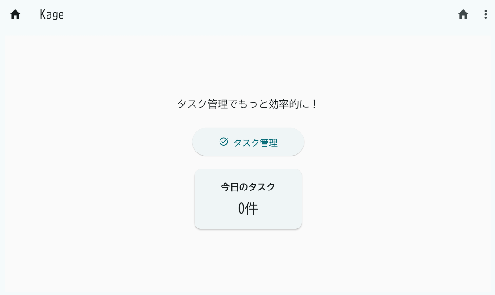
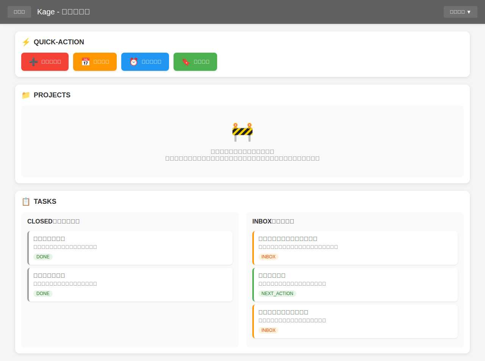
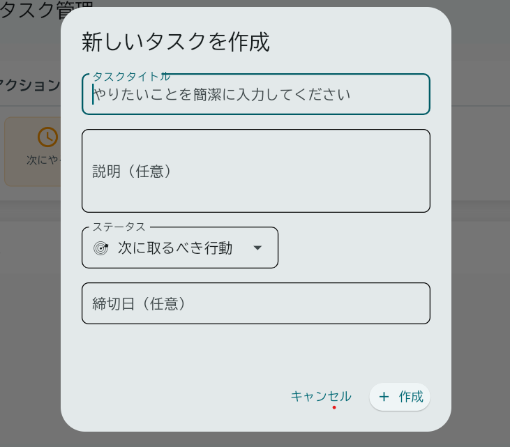

# UI ガイド - Kage

## はじめに

Kage は、GTD（Getting Things Done）メソッドを活用したタスク管理アプリケーションです。
このドキュメントでは、現在のユーザーインターフェース（UI）について、画面構成と機能を詳しく説明します。

## アプリケーション全体の構成

### 基本レイアウト

Kage アプリケーションは以下の基本構成になっています：

- **アプリケーションバー（ヘッダー）**: すべての画面に共通
- **メインコンテンツエリア**: 各画面固有の内容
- **ナビゲーション**: アプリケーションバーのボタンとメニューによる画面遷移

### カラーテーマ

- **ベースカラー**: グレー系（Grey 700）
- **背景色**: ライトモード基調
- **アクセントカラー**: 各機能に応じた色分け
  - 緊急タスク: 赤 (Red 500)
  - 次のアクション: オレンジ (Orange 500)
  - いつかやる: 青 (Blue 500)
  - 参考資料: 緑 (Green 500)

## 1. ホーム画面（メイン画面）

### 画面概要

ホーム画面は、Kage アプリケーションの起点となる画面です。
ユーザーがアプリケーションを起動すると最初に表示されます。

**アクセス方法**: 
- アプリケーション起動時の初期画面
- アプリケーションバーの「ホーム」ボタンをクリック
- URL: `/`

### 画面構成


*ホーム画面：ウェルカムメッセージ、タスク管理ボタン、今日のタスク統計が表示される*

#### アプリケーションバー
- **タイトル**: "Kage"
- **ホームボタン**: 現在の画面（ホーム）に戻る
- **メニューボタン**: ドロップダウンメニューでタスク画面への遷移

#### メインコンテンツ

1. **ウェルカムメッセージ**
   - テキスト: "タスク管理でもっと効率的に！"
   - 中央揃え、グレー系のテキストカラー
   - フォントサイズ: 18px

2. **メインアクションボタン**
   - **タスク管理ボタン**
     - ラベル: "タスク管理"
     - アイコン: タスクアイコン（task_alt）
     - サイズ: 幅200px、高さ50px
     - フォントサイズ: 16px
     - 機能: タスク管理画面（`/task`）への遷移

3. **統計情報カード**
   - **今日のタスクカード**
     - タイトル: "今日のタスク"
     - 件数表示: "X件" 形式
     - カードデザイン: 影付き、角丸
     - 幅: 200px

### 操作方法

- **タスク管理ボタン**: クリックでタスク管理画面に遷移
- **アプリケーションバーのメニュー**: タスク管理画面への別の遷移方法

## 2. タスク管理画面

### 画面概要

タスク管理画面は、GTD メソッドに基づいたタスク管理の中核機能を提供します。
3つのセクション（クイックアクション、プロジェクト、タスクボード）で構成された縦型レイアウトです。

**アクセス方法**: 
- ホーム画面の「タスク管理」ボタン
- アプリケーションバーのメニューから選択
- URL: `/task`

### 画面構成


*タスク管理画面：クイックアクション、プロジェクトプレースホルダー、タスクボードの3セクション構成*

#### アプリケーションバー
- **タイトル**: "Kage - タスク管理"
- **ホームボタン**: ホーム画面（`/`）への遷移
- **メニューボタン**: ナビゲーションオプション

#### セクション1: クイックアクション（QUICK-ACTION）

GTD の「2分ルール」と「タスクの性質分類」を支援するクイックアクションボタンが水平に配置されています。


*クイックアクション：GTDメソッドに基づく4つのアクションボタン（すぐにやる、次にやる、いつかやる、参考資料）*

**ボタン構成**:

1. **すぐにやる** (DO_NOW)
   - アイコン: 追加アイコン（add_circle）
   - カラー: 赤（Red 500）
   - 機能: 緊急・重要なタスクの作成

2. **次にやる** (DO_NEXT)
   - アイコン: スケジュールアイコン（schedule）
   - カラー: オレンジ（Orange 500）
   - 機能: Next Action として優先的に実行するタスクの作成

3. **いつかやる** (DO_SOMEDAY)
   - アイコン: 時計アイコン（access_time）
   - カラー: 青（Blue 500）
   - 機能: Someday/Maybe リストのタスク作成

4. **参考資料** (REFERENCE)
   - アイコン: ブックマークアイコン（bookmark）
   - カラー: 緑（Green 500）
   - 機能: 参考資料・情報として保存するアイテムの作成

**デザイン特徴**:
- 白背景のコンテナ
- 角丸（12px）
- 影効果（BoxShadow）
- 内側パディング: 16px

#### セクション2: プロジェクト（PROJECTS）

現在開発中の機能で、将来的にプロジェクト管理機能を提供予定です。


*プロジェクトセクション：開発中機能のプレースホルダー表示*

**現在の表示内容**:
- **ヘッダー**: "PROJECTS" + フォルダアイコン
- **プレースホルダーメッセージ**:
  - 建設アイコン（construction）
  - "プロジェクト機能は開発中です"
  - "近日中にリリース予定です。タスクの整理やグループ化機能を提供します。"

**デザイン特徴**:
- グレー背景のプレースホルダーエリア
- 中央寄せレイアウト
- 角丸、影効果

#### セクション3: タスクボード（TASKS）

GTD のタスクステータスに基づいた2カラムのタスクボードです。


*タスクボード：CLOSED（完了済み）とINBOX（未処理）の2カラム構成でタスクを管理*

**レイアウト構成**:
- **左カラム**: CLOSED（完了済みタスク）
- **右カラム**: INBOX（未処理タスク）

**タスクカードの機能**:
- **表示項目**: タスクタイトル、説明、ステータス、作成日時
- **操作**: クリックで編集、ステータス変更、削除
- **色分け**: ステータスによる視覚的分類

**サポートするタスクステータス**:
- `INBOX`: オレンジ - 未処理・要分類
- `NEXT_ACTION`: 緑 - 次にやるべきアクション
- `WAITING`: 黄 - 他者の回答待ち
- `SCHEDULED`: 青 - 日時指定
- `SOMEDAY_MAYBE`: 紫 - いつかやるかも
- `DONE`: グレー - 完了済み

### 操作方法

#### タスクの作成
1. クイックアクションボタンをクリック
2. タスク作成ダイアログが表示
3. タイトル、説明などを入力
4. 保存でタスクが作成され、適切なステータスで分類

#### タスクの編集・管理
1. タスクボード内のタスクカードをクリック
2. タスク編集ダイアログが表示
3. 情報の編集、ステータス変更、削除が可能

#### ナビゲーション
- アプリケーションバーのホームボタンでホーム画面に戻る
- メニューからその他の機能にアクセス（今後追加予定）

## 3. ダイアログとポップアップ

### タスク作成・編集ダイアログ

タスクの作成や編集を行うためのモーダルダイアログです。


*タスク作成・編集ダイアログ：タイトル、説明、ステータス選択、作成日時表示と操作ボタン*

**入力フィールド**:
- **タスクタイトル**: 必須、最大100文字
- **説明**: 任意、複数行対応
- **ステータス**: ドロップダウンで選択
- **作成日時**: 自動設定

**ボタン**:
- **保存**: タスクの作成・更新
- **キャンセル**: ダイアログを閉じる
- **削除**: 編集時のみ表示

### 削除確認ダイアログ

タスク削除時の確認ダイアログです。

**表示内容**:
- タイトル: "タスク削除の確認"
- メッセージ: "「[タスク名]」を削除しますか？この操作は元に戻せません。"
- ボタン: "削除"（確認）、"キャンセル"

## 4. エラーハンドリングとフィードバック

### エラー表示

アプリケーション内でエラーが発生した場合の表示方法：

- **エラーメッセージ**: スナックバーまたはアラートダイアログ
- **成功メッセージ**: 緑色のスナックバー
- **警告メッセージ**: 黄色のスナックバー

### ローディング状態

データの読み込み中やアクション実行中の表示：

- **プログレスインジケーター**: 処理中の視覚的フィードバック
- **ボタンの無効化**: 重複実行の防止

## 5. レスポンシブデザインと操作性

### ウィンドウサイズ対応

- **最小ウィンドウサイズ**: デスクトップアプリケーションとして適切なサイズ
- **スクロール対応**: コンテンツが画面をはみ出す場合の自動スクロール
- **レイアウト調整**: 縦方向の伸縮に対応

### キーボード操作

現在の実装では主にマウス操作中心ですが、将来的にキーボードショートカットの追加を予定：

- **Enter**: ダイアログの確定
- **Escape**: ダイアログのキャンセル
- **ショートカットキー**: タスク作成、画面遷移など（今後追加予定）

## 6. 今後の改善予定

### 近日中の追加機能

1. **プロジェクト管理機能**
   - タスクのグループ化
   - プロジェクト階層表示
   - プロジェクトベースのフィルタリング

2. **検索・フィルタリング機能**
   - タスクタイトル・説明での検索
   - ステータス、日付でのフィルタリング
   - タグ機能

3. **ドラッグ&ドロップ**
   - タスクボード間でのタスク移動
   - 直感的なステータス変更

4. **キーボードショートカット**
   - 効率的な操作のためのホットキー
   - アクセシビリティの向上

### 長期的な改善

1. **AI アシスタント機能**
   - タスクの自動分類・提案
   - コンテキストベースのレコメンデーション

2. **詳細な GTD ワークフロー**
   - 週次レビュー機能
   - Inbox Review の支援
   - Context（@PC、@外出先など）管理

3. **データのエクスポート・インポート**
   - 他のタスク管理ツールとの連携
   - バックアップ・復元機能

---

## 補足情報

### 技術的詳細

- **フレームワーク**: Flet (Flutter for Python)
- **データベース**: SQLite（SQLModel 経由）
- **アーキテクチャ**: クリーンアーキテクチャ + DDD
- **デザインシステム**: Material Design 準拠

### ファイル構成

主要なUI関連ファイル：

```
src/views/
├── home/
│   ├── view.py           # ホーム画面メインビュー
│   └── components.py     # ホーム画面コンポーネント
├── task/
│   ├── view.py           # タスク管理画面メインビュー
│   └── components/       # タスク管理画面コンポーネント
│       ├── quick_actions.py      # クイックアクション
│       ├── tasks_board.py        # タスクボード
│       ├── task_dialog.py        # タスクダイアログ
│       └── projects_placeholder.py # プロジェクトプレースホルダー
└── shared/
    ├── app_bar.py        # 共通アプリケーションバー
    ├── base_view.py      # ベースビュークラス
    └── error_handling_mixin.py # エラーハンドリング
```

このドキュメントは、実際のアプリケーションの開発進捗に合わせて継続的に更新されます。