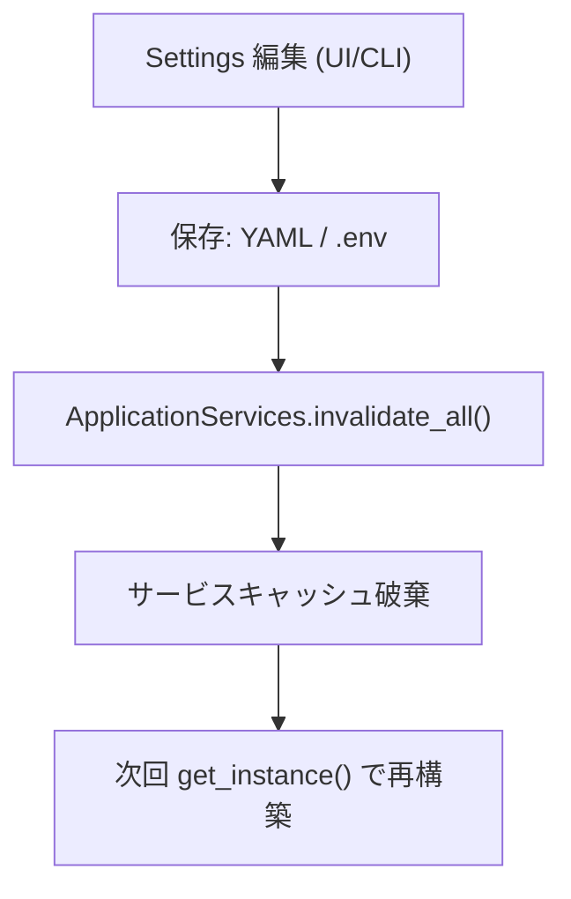

# アプリケーション層の設定アクセス（集中管理）

本ドキュメントは、アプリケーション層から設定値を取得するための統一的な窓口と、その再読込（無効化 → 再構築）手順を示します。

目的:

- 直接 `ConfigManager` に触れず、アプリ層は常に 1 箇所から設定を取得
- 再読込の責務を明確化し、テスト/本番で一貫した挙動を保証
- DI とシングルトンの併用で、読みやすくテストしやすい構成を維持

---

## エントリポイント: SettingsApplicationService

アプリケーション層は `SettingsApplicationService` 経由で設定にアクセスします。

```python
from typing import cast
from logic.application.settings_application_service import SettingsApplicationService

settings_app = cast("SettingsApplicationService", SettingsApplicationService.get_instance())
agents = settings_app.get_agents_settings()
user = settings_app.get_user_settings()

provider = agents.provider
model_name = agents.get_model_name("one_liner")  # 用途キーでモデル取得（例）
current_user = user.user_name
```

ポイント:

- 取得は軽量な読み取り（キャッシュ）として扱い、更新は UI/CLI 等の編集レイヤで行う
- 直接 `os.getenv` / `ConfigManager` に触れないこと

---

## 無効化と再構築（invalidate → rebuild）

設定が更新されたら、次のどちらかで再構築します。

- グローバルに再構築: `ApplicationServices.invalidate_all()`
- 設定のみ再構築: `SettingsApplicationService.invalidate()`

```python
# 例: 設定編集直後にアプリサービス群を再構築
from logic.application.apps import ApplicationServices

# YAML 保存や .env 反映が終わったら
ApplicationServices.invalidate_all()
# 以降に取得する各 ApplicationService は最新設定で再構築される
```

Mermaid フロー（概念図）:



---

## ApplicationService 実装例（ベストプラクティス）

各 ApplicationService は、初期化時に設定をまとめて取得し、メンバーへキャッシュします。

```python
from typing import cast
from logic.application.base import BaseApplicationService
from logic.application.settings_application_service import SettingsApplicationService

class SomeApplicationService(BaseApplicationService[type[SqlModelUnitOfWork]]):
    def __init__(self, unit_of_work_factory: type[SqlModelUnitOfWork] = SqlModelUnitOfWork) -> None:
        super().__init__(unit_of_work_factory)
        settings_app = cast("SettingsApplicationService", SettingsApplicationService.get_instance())
        agents = settings_app.get_agents_settings()
        self._provider = agents.provider  # 必要な設定をキャッシュ
        # ... 以降の初期化
```

注意:

- 設定変更を反映する場合は `ApplicationServices.invalidate_all()` を呼ぶ（再取得で最新に）
- コンストラクタのテスト用オーバーライド引数（`provider=...` 等）は撤去し、
  - a) `SettingsApplicationService.get_instance()` のスタブ
  - b) もしくは下位オブジェクト（Agent 等）の DI
    でテスト可能にする

---

## テストでのスタブ化パターン

設定の差し替えは `SettingsApplicationService.get_instance()` を monkeypatch します。

```python
import pytest

class AgentsStub:
    def __init__(self, provider, model_value):
        self.provider = provider
        self._model_value = model_value
    def get_model_name(self, key: str):  # noqa: D401
        return self._model_value

class UserStub:
    def __init__(self, name: str):
        self.user_name = name

class SettingsAppStub:
    def __init__(self, provider, model, user_name):
        self._agents = AgentsStub(provider, model)
        self._user = UserStub(user_name)
    def get_agents_settings(self):
        return self._agents
    def get_user_settings(self):
        return self._user

@pytest.fixture
def stub_settings(monkeypatch: pytest.MonkeyPatch):
    import logic.application.one_liner_application_service as target
    monkeypatch.setattr(target.SettingsApplicationService, "get_instance", lambda: SettingsAppStub(...))
```

---

## マイグレーションノート（今回の変更点）

- OneLiner / Memo / MemoToTask の `provider` 直指定引数は撤去
- 以降は必ず `SettingsApplicationService` 経由で取得
- 既存テストは設定スタブまたは Agent DI に移行

---

## FAQ / トラブルシュート

- Q. 設定を編集したのに反映されません

  - A. 編集保存後に `ApplicationServices.invalidate_all()` を呼び、次回取得で再構築してください。

- Q. どの層が設定を編集すべきですか？

  - A. 編集は UI/CLI/設定管理層で行い、アプリケーション層は読み取り専用に徹します。

- Q. 直接 `ConfigManager` を使っても良いですか？
  - A. アプリ層では非推奨です。`SettingsApplicationService` を使用してください。

最終更新: 2025-11-07
